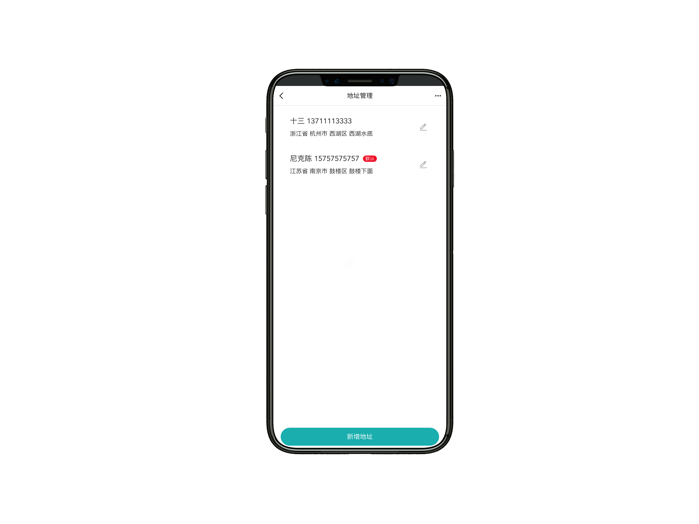
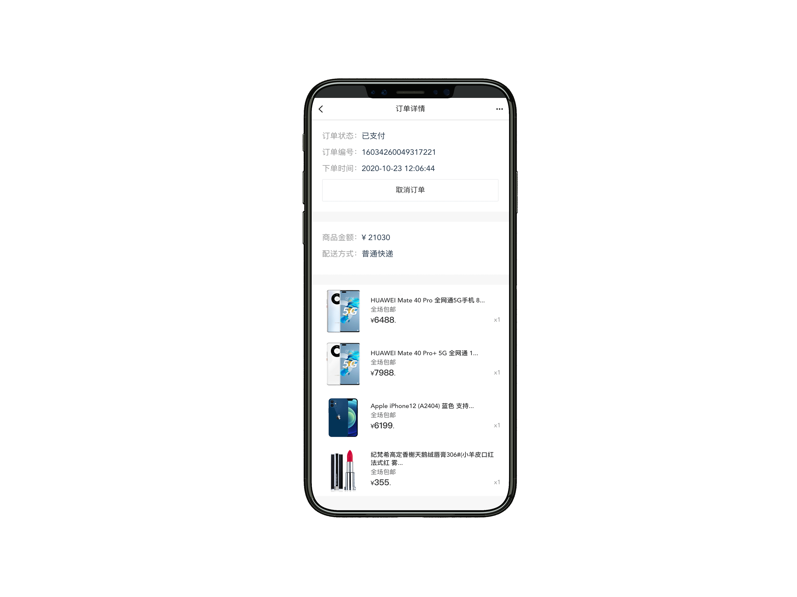

newbee-mall 專案是一套電商系統，基於 Spring Boot 2.X 和 Vue 以及相關技術棧開發。前臺商城系統包含首頁門戶、商品分類、新品上線、首頁輪播、商品推薦、商品搜索、商品展示、購物車、訂單結算、訂單流程、個人訂單管理、會員中心、幫助中心等模組。 後臺管理系統包含數據面板、輪播圖管理、商品管理、訂單管理、會員管理、分類管理、設定等模組。

目前分支的 Spring Boot 版本為 2.3.7.RELEASE，想要學習和使用其它版本可以直接點選下方的分支名稱跳轉至對應的倉庫分支中。

| 分支名稱                                                    | Spring Boot Version |
| ------------------------------------------------------------ | ------------------- |
| [spring-boot-2.3.7](https://github.com/newbee-ltd/newbee-mall-api/tree/spring-boot-2.3.7) | 2.3.7-RELEASE       |
| [spring-boot-2.6.x](https://github.com/newbee-ltd/newbee-mall-api/tree/spring-boot-2.6.x) | 2.6.3               |
| [main](https://github.com/newbee-ltd/nnewbee-mall-api)            | 2.7.3               |

## newbee-mall （新蜂商城）系列專案概覽

| 專案名稱             | 倉庫地址                                                     | 備註                                                         |
| :------------------- | ------------------------------------------------------------ | ------------------------------------------------------------ |
| newbee-mall          | [newbee-mall in GitHub](https://github.com/newbee-ltd/newbee-mall) [newbee-mall in Gitee](https://gitee.com/newbee-ltd/newbee-mall) | 初始版本、Spring Boot、Thymeleaf、MyBatis、MySQL             |
| newbee-mall-plus     | [newbee-mall-plus in GitHub](https://github.com/newbee-ltd/newbee-mall-plus) [newbee-mall-plus in Gitee](https://gitee.com/newbee-ltd/newbee-mall-plus) | 升級版本、優惠券、秒殺、支付、Spring Boot、Thymeleaf、MyBatis、MySQL、Redis |
| newbee-mall-cloud    | [newbee-mall-cloud in GitHub](https://github.com/newbee-ltd/newbee-mall-cloud) [newbee-mall-cloud in Gitee](https://gitee.com/newbee-ltd/newbee-mall-cloud) | 微服務版本、分佈式事務、Spring Cloud Alibaba、Nacos、Sentinel、OpenFeign、Seata |
| newbee-mall-api      | [newbee-mall-api in GitHub](https://github.com/newbee-ltd/newbee-mall-api) [newbee-mall-api in Gitee](https://gitee.com/newbee-ltd/newbee-mall-api) | 前後端分離、Spring Boot、MyBatis、Swagger、MySQL             |
| newbee-mall-api-go   | [newbee-mall-api-go in GitHub](https://github.com/newbee-ltd/newbee-mall-api-go) [newbee-mall-api-go in Gitee](https://gitee.com/newbee-ltd/newbee-mall-api-go) | 前後端分離、Go、Gin、MySQL                                   |
| newbee-mall-vue-app  | [newbee-mall-vue-app in GitHub](https://github.com/newbee-ltd/newbee-mall-vue-app) [newbee-mall-vue-app in Gitee](https://gitee.com/newbee-ltd/newbee-mall-vue-app) | 前後端分離、Vue 2.x、Vant                                    |
| newbee-mall-vue3-app | [newbee-mall-vue3-app in GitHub](https://github.com/newbee-ltd/newbee-mall-vue3-app) [newbee-mall-vue3-app in Gitee](https://gitee.com/newbee-ltd/newbee-mall-vue3-app) | 前後端分離、Vue 3.0、Vue-Router 4.0、Vuex 4.0、Vant 3.0      |
| vue3-admin           | [vue3-admin in GitHub](https://github.com/newbee-ltd/vue3-admin) [vue3-admin in Gitee](https://gitee.com/newbee-ltd/vue3-admin) | 前後端分離、Vue 3.0、Element-Plus、Vue-Router 4.0、Vite      |

**堅持不易，如果覺得專案還不錯的話可以給專案一個 Star 吧，也是對我一直更新程式碼的一種鼓勵啦，謝謝各位的支援。**

> 更多 Spring Boot 實戰專案可以關注十三的另一個程式碼倉庫 [spring-boot-projects](https://github.com/ZHENFENG13/spring-boot-projects)，該倉庫中主要是 Spring Boot 的入門學習教程以及一些常用的 Spring Boot 實戰專案教程，包括 Spring Boot 使用的各種示例程式碼，同時也包括一些實戰專案的專案原始碼和效果展示，實戰專案包括基本的 web 開發以及目前大家普遍使用的前後端分離實踐專案等，後續會根據大家的反饋繼續增加一些實戰專案原始碼，擺脫各種 hello world 入門案例的束縛，真正的掌握 Spring Boot 開發。

關注公眾號：**程式設計師十三**，回覆"勾搭"進群交流。

## 開發及部署文件

#### Vue 3 + Spring Boot 版本

- [開篇詞：通關 Vue3 企業級專案開發，升職加薪快人一步](https://juejin.cn/book/6933939264455442444)
- [專案須知和課程約定](https://juejin.cn/book/6933939264455442444)
- [大勢所趨：「前後端分離」開發模式](https://juejin.cn/book/6933939264455442444)
- [Vue3 簡介及開發環境搭建](https://juejin.cn/book/6933939264455442444)
- [Vue3 組合 API 入口 Setup 淺析](https://juejin.cn/book/6933939264455442444)
- [Vue3 之響應式系統 API](https://juejin.cn/book/6933939264455442444)
- [Vue3 之生命週期鉤子函式、提供注入](https://juejin.cn/book/6933939264455442444)
- [Vue3 效能和業務層面上的提升](https://juejin.cn/book/6933939264455442444)
- [Vite2 原理分析及簡單外掛編寫](https://juejin.cn/book/6933939264455442444)
- [Vue-Router 4.x 使用方法及路由原理](https://juejin.cn/book/6933939264455442444)
- [Vue3 實戰專案啟動篇](https://juejin.cn/book/6933939264455442444)
- [後端 API 開發技術選型之 Spring Boot](https://juejin.cn/book/6933939264455442444)
- [後端基礎執行環境和開發工具準備](https://juejin.cn/book/6933939264455442444)
- [Spring Boot 專案搭建及快速上手](https://juejin.cn/book/6933939264455442444)
- [Spring Boot 實踐之 Web 功能開發](https://juejin.cn/book/6933939264455442444)
- [Spring Boot 實踐之檔案上傳處理](https://juejin.cn/book/6933939264455442444)
- [Spring Boot 實踐之整合 MyBatis 運算元據庫](https://juejin.cn/book/6933939264455442444)
- [Spring Boot 實踐之整合 Lombok](https://juejin.cn/book/6933939264455442444)
- [Spring Boot 實踐之整合 Swagger 產生介面文件](https://juejin.cn/book/6933939264455442444)
- [後端 API 專案啟動和執行注意事項](https://juejin.cn/book/6933939264455442444)
- [介面參數處理和統一響應結果](https://juejin.cn/book/6933939264455442444)
- [API 介面開發實戰之使用者登錄介面開發](https://juejin.cn/book/6933939264455442444)
- [API 介面開發實戰之使用者身份認證詳解](https://juejin.cn/book/6933939264455442444)
- [API 介面開發實戰之輪播圖管理模組介面開發](https://juejin.cn/book/6933939264455442444)
- [API 介面開發實戰之商品分類管理模組介面開發](https://juejin.cn/book/6933939264455442444)
- [API 介面開發實戰之商品管理模組介面開發](https://juejin.cn/book/6933939264455442444)
- [API 介面開發實戰之商品配置管理模組介面開發](https://juejin.cn/book/6933939264455442444)
- [API 介面開發實戰之訂單管理模組介面開發](https://juejin.cn/book/6933939264455442444)
- [前後端鑒權的四種方式](https://juejin.cn/book/6933939264455442444)
- [Vite2 + Vue3 + Element-plus 搭建管理後臺專案](https://juejin.cn/book/6933939264455442444)
- [Vue3 實戰之管理後臺左右欄目佈局](https://juejin.cn/book/6933939264455442444)
- [Vue3 實戰之登錄鑒權](https://juejin.cn/book/6933939264455442444)
- [Vue3 實戰之首頁大盤數據](https://juejin.cn/book/6933939264455442444)
- [Vue3 實戰之首頁配置](https://juejin.cn/book/6933939264455442444)
- [Vue3 實戰之分類管理](https://juejin.cn/book/6933939264455442444)
- [Vue3 實戰之商品管理](https://juejin.cn/book/6933939264455442444)
- [Vue3 實戰之訂單管理](https://juejin.cn/book/6933939264455442444)
- [Vue3 實戰之會員管理、賬戶修改](https://juejin.cn/book/6933939264455442444)
- [pm2 實現一鍵部署雲端伺服器](https://juejin.cn/book/6933939264455442444)
- [常見問題彙總講解](https://juejin.cn/book/6933939264455442444)

#### Vue 2.6 + Spring Boot 版本

- [向「全棧」進發！大型線上商城實戰專案，Spring Boot + Vue 前後端分離版本的商城來了！](https://juejin.im/book/6844733826191589390)
- [專案須知和課程約定](https://juejin.im/book/6844733826191589390)
- [全棧開發！你必須要知道的「前後端分離」](https://juejin.im/book/6844733826191589390)
- [前端模組化的發展歷史](https://juejin.im/book/6844733826191589390)
- [傳統頁面和單頁面的權衡與抉擇](https://juejin.im/book/6844733826191589390)
- [準備工作及基礎環境搭建（後端）](https://juejin.im/book/6844733826191589390)
- [Spring Boot 專案初體驗--專案搭建及啟動](https://juejin.im/book/6844733826191589390)
- [專案編碼簡化利器！Spring Boot 整合 Lombok](https://juejin.im/book/6844733826191589390)
- [Lombok 外掛問題處理](https://juejin.im/book/6844733826191589390)
- [商城後端專案啟動和執行注意事項](https://juejin.im/book/6844733826191589390)
- [VSCode 的相關配置及外掛介紹](https://juejin.im/book/6844733826191589390)
- [基礎篇：Vue 指令](https://juejin.im/book/6844733826191589390)
- [基礎篇：Vue全域性API及生命週期介紹](https://juejin.im/book/6844733826191589390)
- [基礎篇: CSS 預處理工具Less的介紹及使用](https://juejin.im/book/6844733826191589390)
- [Vue 腳手架工具 Vue-Cli 配置介紹](https://juejin.im/book/6844733826191589390)
- [Vue-Router 淺析原理及使用](https://juejin.im/book/6844733826191589390)
- [全域性狀態管理外掛 Vuex 介紹及使用](https://juejin.im/book/6844733826191589390)
- [商城前端 H5 開發環境搭建及專案啟動](https://juejin.im/book/6844733826191589390)
- [前後端互動文件利器！Spring Boot 整合 Swagger](https://juejin.im/book/6844733826191589390)
- [介面參數處理和統一響應結果](https://juejin.im/book/6844733826191589390)
- [口設計規範及介面呼叫實踐](https://juejin.im/book/6844733826191589390)
- [商城開發實戰-使用者登錄介面開發](https://juejin.im/book/6844733826191589390)
- [商城開發實戰-使用者身份認證詳解](https://juejin.im/book/6844733826191589390)
- [商城開發實戰-首頁模組介面開發](https://juejin.im/book/6844733826191589390)
- [商城開發實戰-分類模組介面開發](https://juejin.im/book/6844733826191589390)
- [商城開發實戰-商品搜索模組介面開發](https://juejin.im/book/6844733826191589390)
- [商城開發實戰-購物車模組介面開發](https://juejin.im/book/6844733826191589390)
- [商城開發實戰-個人資訊及收貨地址介面開發](https://juejin.im/book/6844733826191589390)
- [商城開發實戰-下單流程介面開發](https://juejin.im/book/6844733826191589390)
- [商城開發實戰-訂單處理流程詳解](https://juejin.im/book/6844733826191589390)
- [商城移動端開發實戰-新蜂商城登錄註冊頁(前端鑒權)](https://juejin.im/book/6844733826191589390)
- [商城移動端開發實戰-商城首頁製作(輪播圖、首頁商品列表)](https://juejin.im/book/6844733826191589390)
- [商城移動端開發實戰-商品分類頁面製作(better-scrol的介紹及使用)](https://juejin.im/book/6844733826191589390)
- [商城移動端開發實戰-商品列表頁面製作(無限滾動載入)](https://juejin.im/book/6844733826191589390)
- [商城移動端開發實戰-商品詳情頁面製作(Vuex 購物車數量全域性管理)](https://juejin.im/book/6844733826191589390)
- [商城移動端開發實戰-商城購物車頁面製作(購物車頁)](https://juejin.im/book/6844733826191589390)
- [商城移動端開發實戰-地址管理頁面及產生訂單頁面製作](https://juejin.im/book/6844733826191589390)
- [商城移動端開發實戰-我的訂單頁面製作](https://juejin.im/book/6844733826191589390)
- [商城 pm2 一鍵部署云伺服器](https://juejin.im/book/6844733826191589390)
- [課程總結](https://juejin.im/book/6844733826191589390)

## 聯繫作者

> 大家有任何問題或者建議都可以在 [issues](https://github.com/newbee-ltd/newbee-mall/issues) 中反饋給我，我會慢慢完善這個專案。

- 我的郵箱：2449207463@qq.com
- QQ技術交流群：719099151 796794009

## 軟體著作權

>本系統已申請軟體著作權，受國家版權局智慧財產權以及國家計算機軟體著作權保護！

## 介面文件

## 頁面展示

以下為新蜂商城 Vue 版本的頁面預覽：

- 登錄頁

- 首頁

- 商品搜索

- 商品詳情頁

- 購物車

- 產生訂單

- 地址管理

- 訂單列表

- 訂單詳情

## 感謝

- [spring-projects](https://github.com/spring-projects/spring-boot)
- [mybatis](https://github.com/mybatis/mybatis-3)
- [swagger](https://github.com/swagger-api)
- [Lombok](https://github.com/rzwitserloot)
